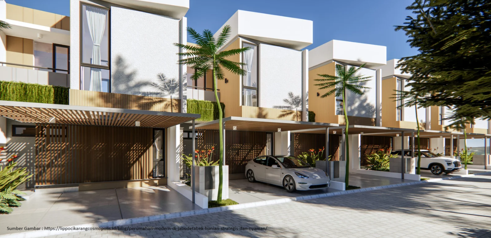
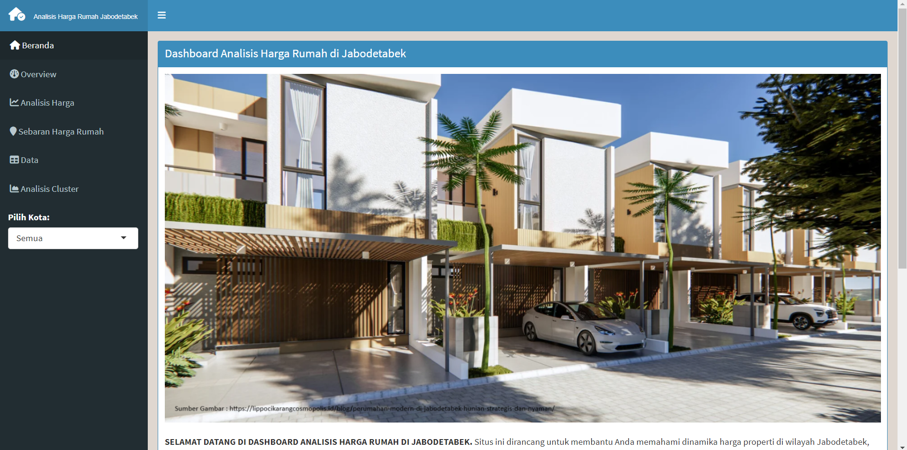

  

# JAB-TASK : Analisis dan Visualisasi Harga Perumahan di Jabodetabek

## :bookmark_tabs: Menu

- [Information](#house-Information)
- [About](#clipboard-About)
- [Screenshot](#camera-Screenshot)
- [Demo](#card_file_box-Demo)
- [Packages](#exclamation-Packages)
- [Data Description](#heavy_check_mark-Data-Description)
- [Our Team](#heavy_heart_exclamation-Our-Team)

## 🏠 INFORMATION
:heartpulse: HELLO...!!
WELCOME TO OUR DASHBOARD! :wave:

**Here's a information about our Dashboard :**

Situs ini dirancang untuk membantu dalam memahami dinamika harga properti di wilayah Jabodetabek, yang meliputi Jakarta, Bogor, Depok, Tangerang, dan Bekasi. Harga rumah di kawasan ini dipengaruhi oleh berbagai faktor, seperti lokasi strategis, aksesibilitas transportasi, fasilitas umum, serta kondisi pasar properti secara keseluruhan. Melalui analisis data yang komprehensif, kami berusaha memberikan gambaran yang jelas mengenai tren harga, wilayah potensial untuk investasi, serta menginformasikan bagi Anda yang sedang mencari hunian ideal atau peluang investasi.

## 📋ABOUT

Berikut adalah beberapa fitur utama dalam dashboard:

**Overview:** Menampilkan ringkasan statistik harga rumah.

**Analisis Harga:** Menyediakan analisis mendalam mengenai harga rumah.

**Sebaran Harga Rumah:** Peta interaktif dan statistik harga.

**Data:** Menampilkan dataset lengkap untuk referensi.

**Analisis Cluster:** memberikan wawasan lebih mendalam mengenai pola pengelompokan harga rumah di wilayah Jabodetabek.

## :camera: SCREENSHOOT

- Beranda

  

- Overview
  

  

- Analisis Harga

  

- Sebaran Harga Rumah

  

  
- Analisis Cluster

  

## :card_file_box: Demo

The link of our shinnyapps or dashboard project : [https://yudheeet1991.shinyapps.io/shiny-visdat/]

## :exclamation: Packages

- The Dashboard are `shinny`, `shinydashboard`, `ggplot2`, `DT`, `scales`, `tidyr`, `leaflet`, `readr`, `stringr`, and `dplyr` from package R.

## :heavy_check_mark: Data Description

  

Data terdiri dari 14 peubah dengan 1730 observasi

| Attribute (Peubah)         | Type                  | Description                     		                                              |
|:---------------------------|:----------------------|:-------------------------------------------------------------------------------  |
| price_in_rp                | numerik               | Harga properti dalam satuan Rupiah.                       		                    |
| address                    | factor	               | Alamat lengkap properti yang mencakup nama kompleks, jalan, atau area spesifik.  |
| district                   | factor		             | Nama kecamatan atau wilayah tempat properti berada, tanpa detail alamat lengkap. |	
| city                       | factor		             | Nama kota tempat properti berada.                 		                            |
| lat	                       | numerik		           | Koordinat garis lintang lokasi properti dalam sistem geografis.	                |
| long		    	             | numerik               | Koordinat garis bujur lokasi properti dalam sistem geografis.                    |
| Total Luas                 | numerik               | Menunjukkan ukuran tanah properti dan luas area bangunan.                        |
| carports                   | numerik		           | Jumlah carport (tempat parkir mobil tanpa garasi) yang tersedia.                 |	
| electricity                | factor		             | menunjukkan daya yang dapat digunakan.                 		                      |
| floors	                   | numerik		           | Menunjukkan tingkat vertikalitas properti.                      	                |
| property_condition		     | factor                | Kondisi properti saat ini.                                                       |
| building_orientation       | factor                | Arah orientasi bangunan, seperti "timur", "barat", atau "selatan".               |
| garages                    | numerik	             | Jumlah garasi yang tersedia untuk kendaraan.                                     |
| furnishing                 | factor		             | Tingkat kelengkapan interior rumah.                                              |	

## :heavy_heart_exclamation: Our Team

- [Rachmat Bintang Yudhianto](https://github.com/yudheeeeet) (G1501231030)
- [Yunna Mentari Indah](https://github.com/yunnamentari) (G1501231017)

